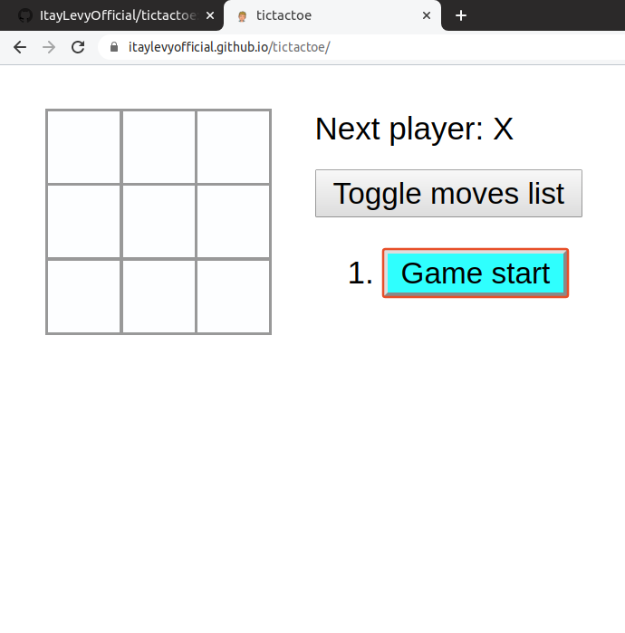
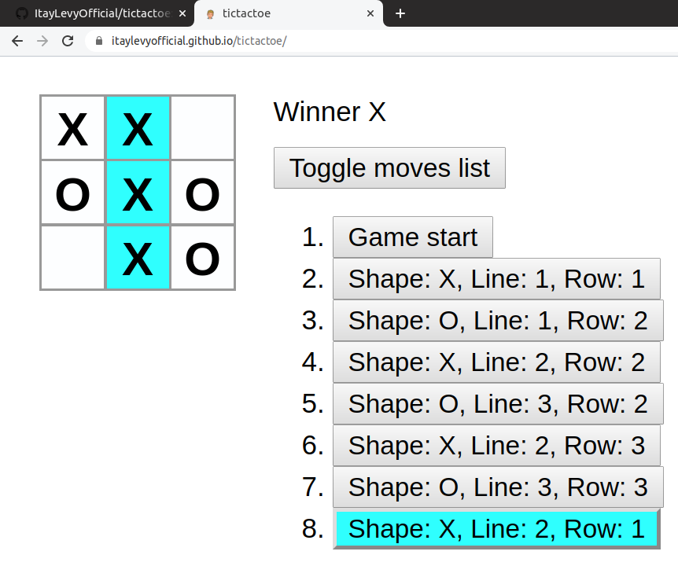

# Tic-tac-toe
## Tic-tac-toe web app, written with react.
## Website link : [tic-tac-toe](https://itaylevyofficial.github.io/tictactoe/)
## Screenshots:
### Begin

### End

## Supports:
* ### Highlights winning row. 
* ### Declares the winner.
* ### Stops game after defeat.
* ### Allows Jump back to previous moves.
* ### Toggle moves list upside-down.

